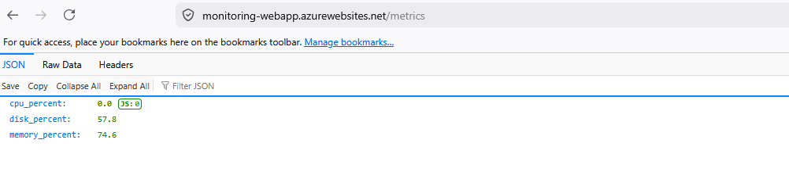
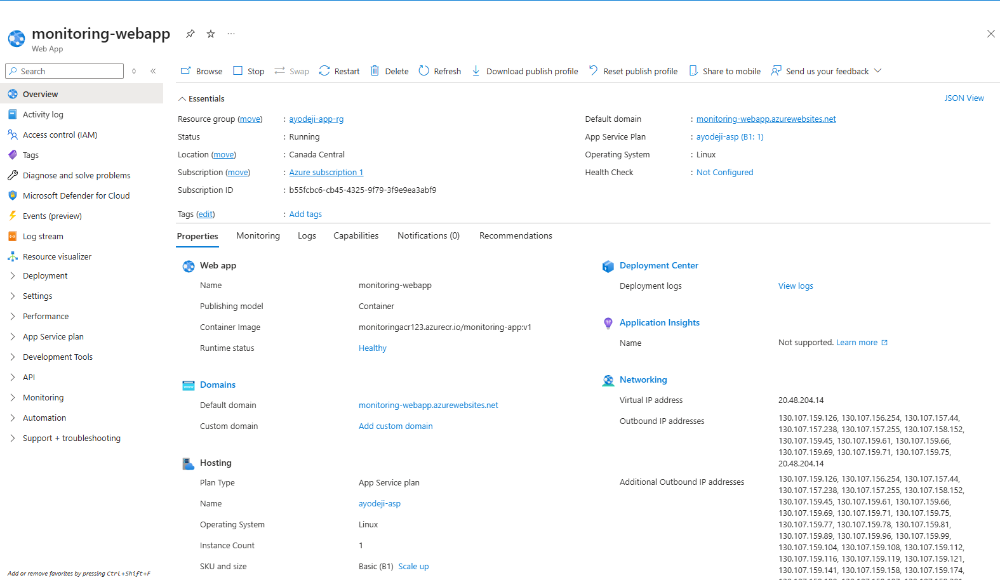
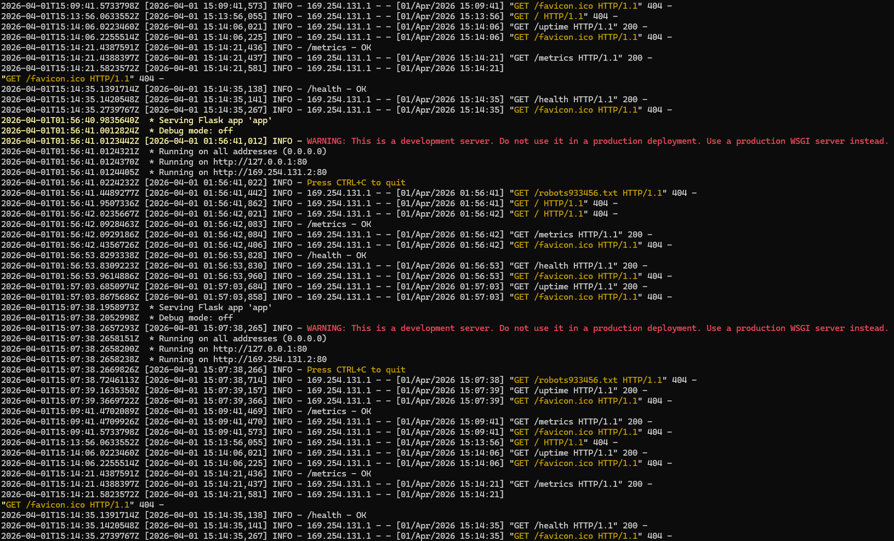

## Project Title -  Cloud-Native Monitoring Service on Azure

### Overview

This project demonstrates how to design, containerize, and deploy a cloud-native monitoring service using Docker and Azure.

It follows a real-world workflow:
- Build and containerize a Python Flask application
- Push the image to Azure Container Registry (ACR)
- Deploy it to Azure App Service
- Monitor system-level metrics (CPU, memory, disk)

The project focuses on understanding container lifecycle, cloud deployment behavior, authentication between services, and debugging real-world issues.

## Project Evolution

### Dockerized Flask App – Phase 1


This project demonstrates how to package a simple Python web application into a Docker container and run it locally.

### What I Did
* Built a simple Flask application.
* Created a Dockerfile to containerize the app
* Built a Docker image
* Ran the container locally with port mapping
* Verified the application via browser.

### Next Steps
* Push image to Azure Container Registry
* Deploy container to Azure App Service

### Cloud Deployment with Azure - Phase 2
### Overview

After successfully containerizing and running the Flask application locally using Docker, the next step was to deploy the application to the cloud using Azure.

#### Application Features
The monitoring service exposes the following endpoints:
* /health – basic health check.
* /uptime – application uptime in seconds.
* /metrics – system‑level metrics (CPU, memory, disk)

All responses are returned in JSON format.

Access:
``` 
https://monitoring-webapp.azurewebsites.net/uptime
https://monitoring-webapp.azurewebsites.net/metrics
https://monitoring-webapp.azurewebsites.net/health
```

#### *Required troubleshooting around image pulls, port binding, and container restarts (details in troubleshooting notes)*

#### Architecture
Local Machine → Docker Image → Azure Container Registry → Azure App Service → Public Web URL


### System Monitoring Service and Observability - Phase 3
Deployed the updated service using the same Docker → Azure workflow and evolved the application by adding:
* /status – aggregated runtime and dependency status.
* /check – external dependency connectivity checks across multiple services.
* Integrated system-level metrics collection using psutil.

Access:
``` 
https://monitoring-webapp.azurewebsites.net/check
https://monitoring-webapp.azurewebsites.net/status
```

### VM Deployment and Infrastructure Responsibility - Phase 4
 
Deployed the same containerized monitoring application on a Linux virtual machine to explore Infrastructure‑as‑a‑Service (IaaS) trade‑offs.
 
### Version Evolution

- v1: Basic Flask application.
- v2: Application containerized using Docker for consistent local and cloud execution.
- v3: Containerized application deployed to Azure App Service with managed runtime and lifecycle behavior.
- v4: Application expanded into a monitoring service with health, status, metrics, and dependency checks.

Each version was built as a versioned container image and stored in Azure Container Registry, enabling controlled deployments and rollbacks across environments.

### Key Operational Learnings

* Versioned images enable safe deployments and rollbacks.
* Container images must be explicitly authorized for pull access when using private registries.
* System metrics in cloud containers reflect the broader runtime environment, not just application logic.
* Many cloud deployment issues only surface through hands‑on troubleshooting.
* Managed platforms such as Azure App Service actively supervise application lifecycles, automatically handling restarts, health monitoring, and host-level failures.
*  Virtual machines provide greater flexibility and control but require explicit management of operating system updates, networking, process recovery, and runtime behavior.

These learnings emphasize the trade-offs between convenience and control when choosing between Infrastructure-as-a-Service and Platform-as-a-Service models.

### Final Outcome
* Application successfully containerized using Docker.
* Image stored and versioned in Azure Container Registry..
* Application deployed and operated on Azure App Service with managed lifecycle behavior.
* The same containerized application deployed on a Linux virtual machine to compare infrastructure-level responsibilities.
* Public URL accessible via browser.
### Screenshots

#### Monitoring Endpoint (Live)


#### Azure App Service Overview


#### Log Streaming (Debugging)
