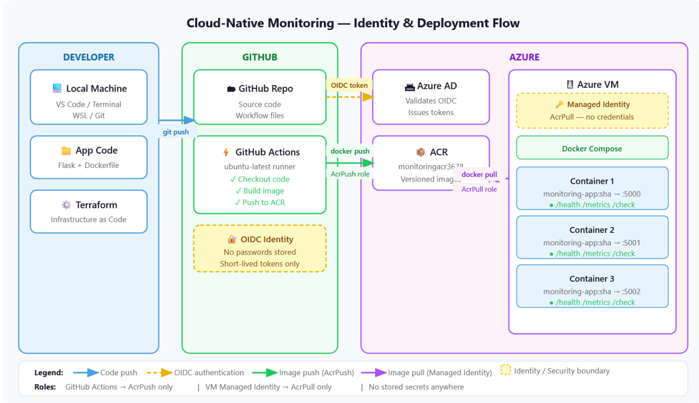
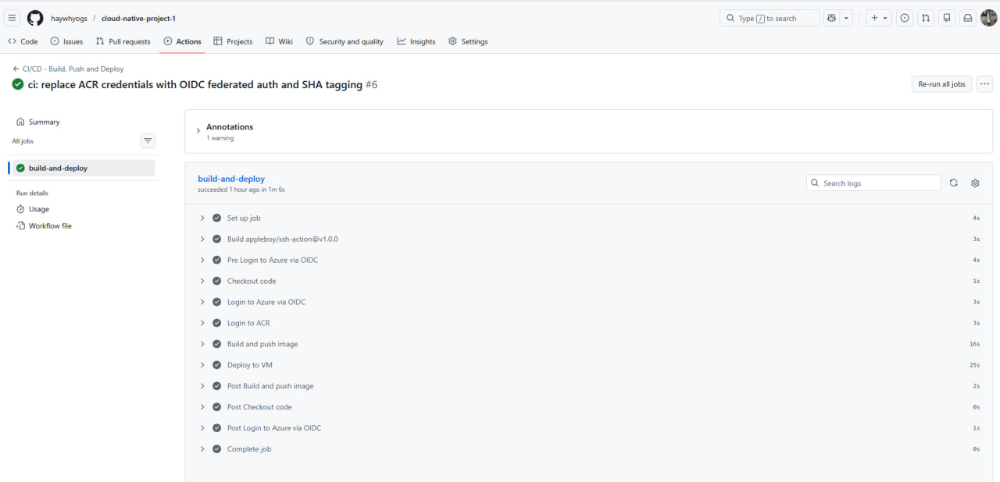
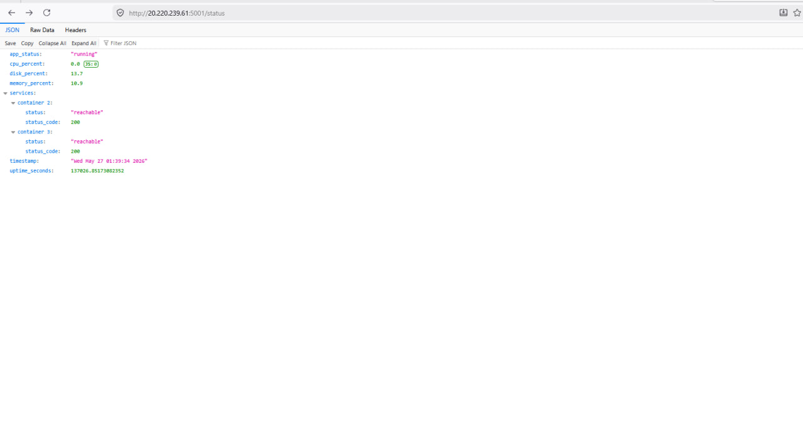
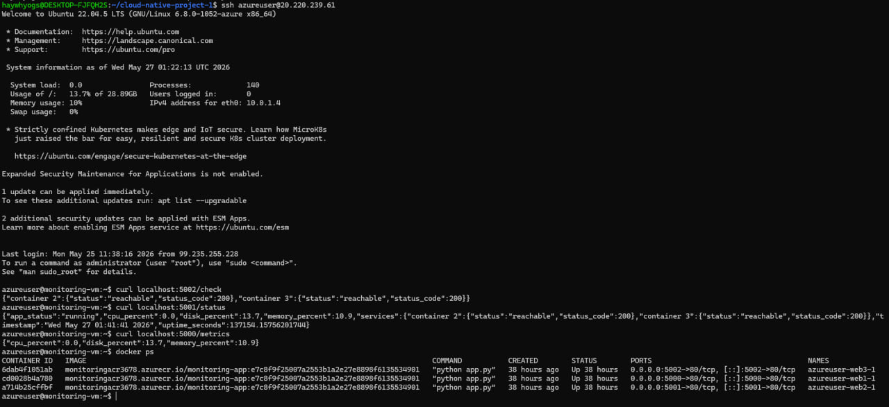

# Cloud-Native Monitoring Service on Azure
# Cloud-Native Monitoring Service on Azure


A containerized Python monitoring service built to simulate real-world cloud
infrastructure — from a single local container to a fully automated,
multi-container deployment on Azure with a complete CI/CD pipeline.

---

## What It Does

The monitoring service runs as three independent container instances, each
exposing health, metrics, and dependency check endpoints. Each container
actively monitors the others — if one goes down, the others report it
immediately via the `/check` endpoint.

Deployments are fully automated. Pushing code to `main` triggers a GitHub
Actions pipeline that builds a new Docker image, pushes it to Azure Container
Registry, and deploys it to the VM — with no manual steps.

---

## Live Endpoints

> All three containers are currently running on the same VM on different ports.

```
http://20.220.239.61:5000/health
http://20.220.239.61:5000/status
http://20.220.239.61:5000/metrics
http://20.220.239.61:5001/status
http://20.220.239.61:5002/status
```


> Note: VM may be deallocated when not actively in use to manage cloud costs.

---

## Architecture



> See [ARCHITECTURE.md](ARCHITECTURE.md) for the full breakdown including
> network layout, identity flow, and infrastructure components.

---

## Tech Stack

| Layer | Tool |
|-------|------|
| Application | Python, Flask |
| Containerization | Docker, Docker Compose |
| Image Registry | Azure Container Registry (ACR) |
| Compute | Azure Virtual Machine (Ubuntu 22.04) |
| Infrastructure as Code | Terraform |
| VM Bootstrap | cloud-init |
| CI/CD | GitHub Actions |
| Authentication | OIDC Federated Identity, Azure Managed Identity |
| State Management | Azure Blob Storage (remote Terraform state) |

---

## Project Evolution

| Phase | What was built |
|-------|---------------|
| 1 | Dockerized Flask app — local container, Dockerfile, port mapping |
| 2 | Azure App Service deployment — ACR, managed runtime, public URL |
| 3 | Monitoring endpoints — /health, /uptime, /metrics, /status, /check |
| 4 | VM deployment — IaaS, manual container management, restart policies |
| 5 | Infrastructure as Code — Terraform, remote state, cloud-init automation |
| 6 | Multi-container + ACR — three instances, Docker networking, Managed Identity |
| 7 | CI/CD pipeline — GitHub Actions, OIDC, SHA tagging, zero manual steps |

---

## CI/CD Pipeline

Every push to `main` triggers the pipeline automatically:

```
git push → GitHub Actions
  ├── Login to Azure (OIDC — no passwords stored)
  ├── Build Docker image
  ├── Push to ACR (tagged with commit SHA)
  └── SSH into VM → pull new image → restart containers
```

No credentials are stored in the pipeline. GitHub authenticates to Azure
using federated identity (OIDC) and the VM authenticates to ACR using its
system-assigned Managed Identity.



---

## Screenshots

### Monitoring Status Endpoint (live)


### Containers Running on VM


---
## Architecture Decisions

**Why Virtual Machine instead of Kubernetes**
- Chosen to understand infrastructure fundamentals (networking, OS, container runtime) before introducing orchestration complexity
- Provides full control over runtime, networking, and deployment flow
- Keeps the system transparent and debuggable during early-stage design

**Why Docker Compose**
- Simple, declarative multi-container orchestration on a single host
- Built-in networking and service discovery via container names
- Sufficient for a 3-service architecture without introducing Kubernetes overhead

**Why Managed Identity**
- Eliminates need for stored credentials on the VM
- Azure handles identity lifecycle and token issuance automatically
- Enforces least privilege (AcrPull only)

**Why OIDC (GitHub Actions)**
- Removes static credentials from CI/CD pipeline entirely
- Uses short-lived tokens issued per workflow run
- Strong security boundary tied to repo + branch (federated identity)
## Key Learnings

- Infrastructure as Code makes environments fully reproducible — a single
  `terraform apply` provisions networking, compute, and deploys containers
- `write_files` in cloud-init runs before system users exist — file ownership
  must be set in `runcmd`, not in the write_files block
- `localhost` inside a container refers to that container only — container-to-
  container communication requires Docker service names as internal DNS
- OIDC federated identity eliminates stored credentials entirely — GitHub
  proves its identity to Azure dynamically using short-lived tokens
- Least privilege matters — the pipeline has AcrPush only, the VM has AcrPull
  only, neither can touch anything else
- `base64encode(file())` and `filebase64()` behave differently on Windows —
  always use `base64encode(file())` in WSL environments
- `latest` tags are unsafe — SHA tagging ensures traceability and rollback capability
- Terraform remote state is essential for team-safe infrastructure operations
---
## Status

System is fully deployed and operational on Azure VM with automated CI/CD delivery.

## Documentation

| Document | Contents |
|----------|----------|
| [ARCHITECTURE.md](ARCHITECTURE.md) | Full architecture, network layout, identity flow |
| [docs/INFRASTRUCTURE.md](docs/INFRASTRUCTURE.md) |  Terraform, remote state, cloud-init, Managed Identity |

---

## Git Tags — Project Milestones

| Tag | Milestone |
|-----|-----------|
| `v0.4.0` | Stable — real app image running from ACR with Managed Identity |
| `v0.5.0` | Stable — three containers, /check returning all healthy |
| `v0.6.0` | Stable — full CI/CD pipeline with OIDC and SHA tagging |
